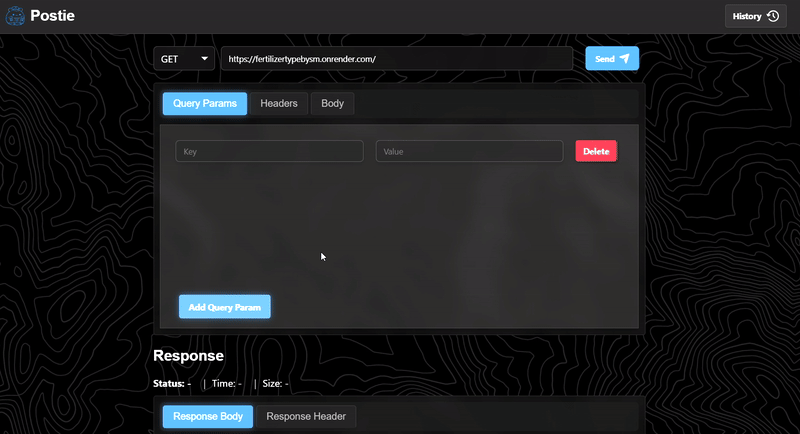
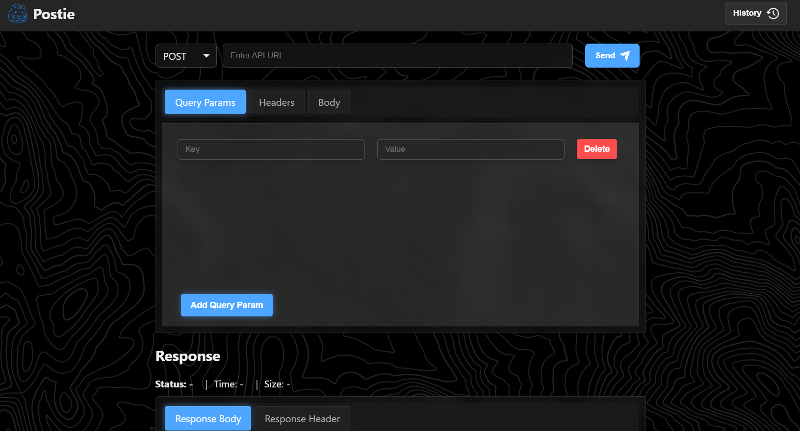
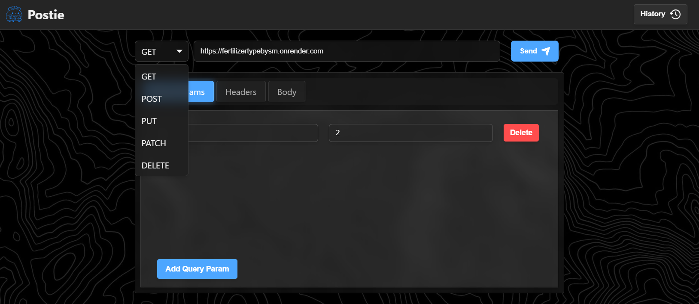
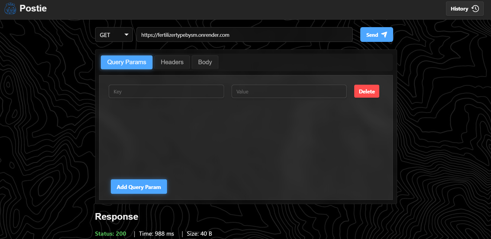
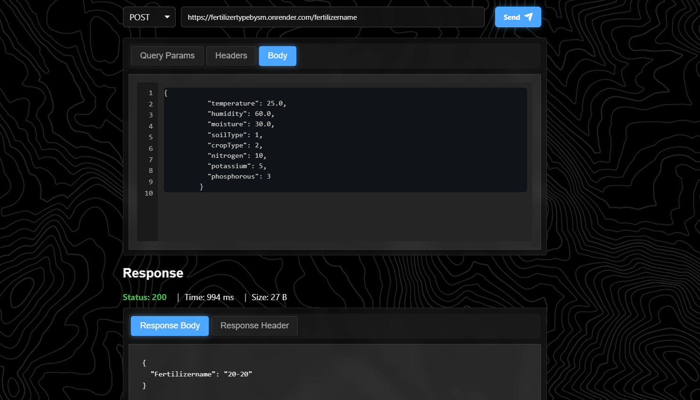
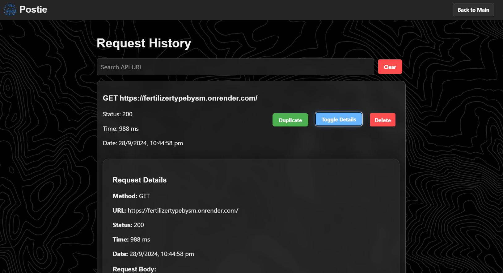

# Postie 

Postie is a lightweight, browser-based API testing tool inspired by Postman. It allows users to send HTTP requests, view responses, and manage request history, all within a sleek and intuitive interface.

## Demo



## Table of Contents


- [Demo](#demo)
- [Features](#features)
- [File Structure](#file-structure)
- [Installation](#installation)
- [Usage](#usage)
- [Screenshots](#screenshots)
- [Technologies Used](#technologies-used)


## Features

- Support for multiple HTTP methods (GET, POST, PUT, PATCH, DELETE)
- Query params and headers management
- Request body editor with line numbers
- Response viewer with body and headers
- Request history with search functionality
- Duplicate requests from history
- Responsive design with a dark theme

## File Structure

- `index.html`: Main page of the application
- `history.html`: Request history page
- `script.js`: Main JavaScript file for the application logic
- `history.js`: JavaScript file for history page functionality
- `styles.css`: Main CSS file for styling
- `history.css`: Additional CSS for the history page
- `logo.png`: Application logo
- `backgroundgrid.jpg`: Background image for the application
- `historylogo.png`: Icon for the history button
- `sendlogo.png`: Icon for the send button

## Installation

1. Clone the repository:
   ```bash
   git clone https://github.com/smresponsibilities/web_project.git
   ```
2. Navigate to the project directory:
   ```bash
   cd web_project
   ```
3. Open `index.html` in your preferred web browser.

## Usage

1. Enter the API URL in the input field.
2. Select the HTTP method from the dropdown.
3. Add query parameters, headers, or request body as needed.
4. Click the "Send" button to make the request.
5. View the response in the response panel.
6. Access request history by clicking the "History" button.

## Screenshots









## Technologies Used

- HTML
- CSS
- JavaScript 
- Local Storage for data persistence

